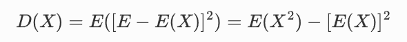
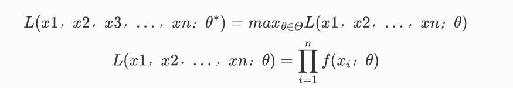

# 专业课问答

快速回顾专业课内容可使用速通网课，以熟悉概念为主，不需要做题，范围也重点关注常考内容，可跳过一些不会被问到(经验贴中从未出现)的内容。考察偏好各校不同，<mark style="color:red;">优先复习线代，概率论，数据结构，操作系统，计算机网络。</mark>

### 一.计算机网络

**1.计算机网络层次**

采用分层的原因：如果采用分层，各层之间是独立的，每一层不用关心其他层次的内容；灵活性好，一层发生变化不影响上下层；易于实现和维护；能促进标准化的工作。缺点是有些功能可能在多层次中反复出现，产生额外开销。

各个分层的功能：应用层实现具体的网络应用。运输层实现不同主机进程之间的逻辑通信，实现复用与分用。网络层实现主机之间的数据传输。数据链路层实现链路上节点之间的数据传输。物理层解决在物理媒介上传输数据的问题。

OSI七层模型有表示层和会话层，TCP/IP四层模型没有物理层。

**2.IPV6**

IPV6主要是为了解决地址不够用等问题出现的，将IP地址扩展为128位。IPV6去掉了校验和字段；去掉了标志，片偏移等字段，不支持在路由器上分片，提高了处理效率；去掉了首部长度与选项字段，固定长度，通过扩展报头实现选项。

**3.TCP与UDP的区别**

TCP与UDP：TCP提供面向连接的可靠传输服务，UDP提供无连接的服务。

* UDP没有拥塞控制机制，不会延迟报文段的发送
* UDP不需要维护连接状态，且首部开销小
* TCP需要建立连接，提供可靠传输，同时提供流量控制，拥塞控制等机制
* TCP是面向字节流的，UDP是面向报文的
* TCP建立点对点的通信，UDP可以一对多通信

**4.TCP连接建立与断开**

TCP连接的建立：

* 客户机TCP向服务器发送连接请求报文段，SYN为1，使用一个初始序号
* 服务器接收到连接请求报文段后，如果同意建立连接，向客户机发送确认，SYN为1，使用一个初始化序号
* 客户机收到服务器响应后，发送确认报文段，可携带数据
* 三次握手：保证连接是双工的，两次不能保证客户端能收到服务器的信息。此外如果有冗余连接请求报文段到达，只有两次握手服务器会建立多余的连接

TCP连接断开：

* 客户端发送FIN断开连接请求报文段
* 服务器收到后响应ACK，客户端到服务器的连接断开
* 服务器没有数据要发送，向客户端发送FIN报文段
* 客户端收到后响应ACK，等待2MSL后关闭

**5.拥塞控制**

TCP的拥塞控制：维护拥塞窗口，控制发送速度，避免网络负载过大

* 慢启动：设置窗口为1MSS，每接收到一个ACK，窗口就+1，到达一个阈值时，进入拥塞避免状态
* 拥塞避免：每经过一个RTT，窗口+1，出现超时时重新开始慢启动，并将慢启动阈值减半
* 快恢复与快重传：收到3个冗余ACK时，立即重传，慢启动阈值和窗口都减半，进入拥塞避免(Reno后的版本才有)

**6.服务与协议的区别**

* 协议是对等层之间通信的规则集合。对等层的通信使得本层能够向上层提供服务。为了实现协议，还要使用下层的服务。下层的协议对于上层服务的实体而言是透明的
* 协议是水平的，服务是垂直的。服务是下层向上层通过接口提供的

### 二.数据结构与算法

**1.常见排序算法和时间复杂度&稳定性**

直接插入排序：每次将一个元素插入已排好序的元素序列。O(n^2)，稳定。

冒泡排序：比较所有相邻的元素，如果前比后大就进行交换。每次会把一个最大的元素交换到未排序元素序列的末尾。O(n^2)，稳定。

选择排序：每次在未排序元素中找到最小元素和未排序序列第一个元素交换。O(n^2)，不稳定。

归并排序：将序列划分为两部分，分别进行排序，然后进行合并。O(nlogn)，稳定。

快速排序：选择一个基准元素，将所有元素划分为小于和大于基准的两部分。继续对两部分进行快速排序。随机基准时间复杂度为O(nlogn)，不稳定。

堆排序：维护一个最大堆，每次取出堆顶的元素放到未排序元素末尾。O(nlogn)，不稳定。

**2.最短路径算法**

Dijikstra：求源点到所有点的最短路径，只能用于无负权边的图。维护点集S，S中点为已找到最短路径的点，每次选择没有确定最短路的距离最短的顶点加入S，并更新源点到其他点的距离。O(n^2)，邻接表堆优化到O((E+V)logV)。

floyd：求任意两点之间的最短路径。O(n^3)。

bellman-ford：对于没有负权回路的图，最短路包含的边最多有n-1条，对所有的边进行n-1轮松弛，得到最短路径。如果n-1次松弛后，仍可以松弛，则图一定存在负权环路。时间复杂度为O(VE)。可以解决负权边的原因是每次对所有边进行松弛。

**3.最小生成树**

最小生成树是图的边权和最小的生成树。

prim算法：从一个点开始，维护包含这个点的连通分支到其他点的最小距离，每次选择与当前连通块距离最小的顶点加入连通分支，直到所有顶点都加入。O(n^2)，邻接表堆优化到O((n+m)logn)。

kruskal算法：每个顶点视为一个连通分支，按照边权大小对边排序，每次选择一条连接两个不同连通分支顶点的边加入当前生成树，直到所有顶点都在一个连通分支当中，得到最小生成树，时间复杂度为O(ElogE)。

**4.P与NP问题**

可在多项式时间可解的判定问题为P类问题

非确定性算法猜测解，如果判定解是否正确可以在多项式时间内完成，则问题为非确定性多项式时间可解的问题(NP问题)

如果任何NP问题都可以多项式时间约化到一个NP问题，则该NP问题为NP完全问题

NP难问题是所有NP问题都可以在多项式时间约化到的问题，该问题可能不是NP问题

**5.二叉搜索树\&AVL**

对于每个节点都有左子树所有节点小于当前节点值，右子树所有节点大于等于当前节点值，且左右子树均为二叉搜索树。查找时间在O(logn)到O(n)之间。

平衡二叉搜索树是改进的二叉搜索树，每个节点的左右子树高度差不超过1，增删后通过旋转的方式重新恢复平衡。

**6.TOP K**

选择一个基准元素，进行元素交换使序列划分为小于基准的和大于基准的，根据左右区间的元素个数判断是否需要继续进行元素选择。时间复杂度最坏为O(n^2)，最好为O(n)。通过随机选择基准使平均时间复杂度为O(n)。

**7.hanoi塔**

将A上的n-1个盘移动到B，最底下的盘移动到C，再将B的盘移动到C上，时间复杂度为O(2^n)。

T(n) = 2T(n-1)+1

**8.并查集**

并查集是一种处理集合的合并和查询问题的数据结构，一般把每个集合用一棵树表示，每个节点记录其父节点。在查询的过程中使用路径压缩提高效率，合并时使用按秩合并(较小的树合并到较大的树上)提高效率。

**9.哈夫曼树**

每次合并两个权值和最小的树。时间复杂度为O(n^2)，使用优先队列优化到O(nlogn)。

### 三.操作系统

**1.进程和线程**

进程是一个正在执行的程序的实例，线程是最小的执行单元。进程有独立的地址空间，是资源分配的基本单位，而线程使用所属进程的地址空间。一个进程的多个线程共享进程的地址空间，便于通信，并且线程之间切换的开销更小。

**2.进程调度算法**

FIFO，STCF，SJF，RR，MLFQ。

**3.操作系统**

操作系统是控制和管理整个计算机的资源，对计算机的资源进行分配，为用户和其他软件提供服务的程序。管理的内容包括处理器，存储器，设备，文件等。

操作系统的特征有：

* 并发：多个事件在一个时间段同时发生，但实际上是分时交替执行
* 共享：系统的资源可供多个并发执行的进程共同使用
* 虚拟：提供处理器，存储空间的虚拟化
* 异步：允许多个程序并发执行而不同步

**4.进程通信的方式**

* 管道：半双工通信，内核会对管道操作进行同步和互斥，进程通过读写管道文件实现通信
* 消息队列：发送进程把消息发送给接收进程，将消息挂在接收进程的消息缓冲队列上，接收进程从消息缓冲队列中取得消息
* 信号：进程之间可以通过发送信号给另一个进程，实现低级别的通信
* 共享内存：多个进程共享内存进行通信，需要保持同步
* SOCKET通信：同一主机的不同进程间和不同主机的进程间进行全双工通信，借助网络的传输层实现

**5.死锁**

死锁产生的四个条件：互斥，持有并等待，非抢占，循环等待

预防死锁：

* 保证加锁的顺序，避免循环等待
* 保证原子性获取所有锁
* 适当的释放自己的锁，避免死锁
* 完全避免互斥
* 允许死锁偶尔发生，检查到再行动

**6.读写者问题**

使用计数器记录当前正在访问文件的读者数/写者数(读优先/写优先)，第一个访问的和最后一个访问的负责加锁和释放锁。

**7.分页和分段**

* 分段机制：根据程序中数据的类型，将虚拟地址空间进行分段。采用分段会导致出现不连续的空闲段，称为外部碎片。分段将程序和数据被划分开，有助于共享和保护
* 分页机制：虚拟地址空间被划分为固定大小的页，从而避免外部碎片，通过页表来记录虚拟页到物理页的映射关系，为了节省空间，还可以使用多级页表，避免为不存在的页分配页表的空间。为了加快速度，可以使用TLB来加速地址转换

### 四.体系结构

**1.流水线冒险**

流水线化的指令执行主要受到流水线冒险的阻碍，包含以下三种冒险，相应的解决方式有：

* 结构冒险：资源冲突导致的冒险。
  * 停顿
  * 增加硬件(需要衡量是否值得)
  * 指令重排序
* 数据冒险：数据相关导致的流水线冒险。
  * 转发
  * 停顿
  * 指令重排序
* 控制冒险：分支指令导致的冒险。
  * 基本预测机制：预测选中/未选中，分支延迟，静态分支预测
  * 动态分支预测：2位分支预测器

### 五.离散数学

**1.离散数学学习了哪些内容**

数理逻辑(命题逻辑和谓词逻辑)、集合论(二元关系和函数)、图论、组合数学、代数系统。

**2.等价关系&偏序关系**

偏序关系：自反、反对称，传递的关系为偏序关系。

等价关系：自反、对称，传递的关系为等价关系。

**3.单射、满射、双射**

A,B为集合，如果f为函数，A为定义域，值域是B的子集，则f称为A到B的函数，如果值域为B，则为满射，如果值域中的元素都有唯一的x，x∈A，使得f(x) = y，则为单射。既是单射又是满射则为双射。

**4.握手定理**

任何图中，所有顶点的度数之和为边数的两倍。有向图中，所有顶点的入度之和等于所有顶点的出度之和。

**5.欧拉图与哈密顿图**

图中通过所有边一次且经过所有顶点的通路为欧拉通路，如果回到起点则为欧拉回路。具有欧拉回路的图为欧拉图。

图中通过所有顶点一次且仅一次的通路为哈密顿图，如果回到起点则为哈密顿回路，具有哈密顿回路的图为哈密顿图。

TSP问题：求最短的哈密顿回路。NP难问题。

**6.代数系统问题**

半群，独异点和群都是有一个二元运算的代数系统。\<R, °>。

如果有一个二元运算的代数系统，运算是可结合的，则为半群；有单位元，则为独异点；每个元素都有逆元，则为群。

如果对于一个包含乘法和加法运算的代数系统，集合和加法构成交换群，和乘法构成半群，且乘运算关于加运算适合分配律，则代数系统为环。\<R,+,\*>

如果环中乘法可交换，且所有不为0的元素都有逆元，为域。

### 六.概率论

**1.古典概型&几何概型**

古典概型是有限个可能事件，且每个事件都是等可能的试验。几何概型是有无限个可能事件，且每个事件都是等可能的试验。

**2.先验概率与后验概率**

先验概率是由以往数据分析得到的概率。

后验概率是事件已发生，计算事件发生的原因是某个事件的概率。

**3.条件概率&全概率公式&贝叶斯公式**

条件概率是指在事件B发生的条件下，事件A发生的概率。

全概率公式是已知样本空间的一个划分B1，B2，...，BN时，求事件A的概率时，P(A)为每种事件Bi发生的概率乘Bi条件下A发生的概率的和。

贝叶斯公式是条件概率公式导出的，求B的条件下A发生的概率，等于P(B|A)P(A)/P(B)。常用于已知结果，求导致结果的原因的概率。

**4.独立与互斥&独立与不相关**

事件A，B有P(AB) = P(A)P(B)，则两事件独立。AB = φ，则两事件互斥。对于概率不为0的事件，互斥不独立，独立不互斥。

两个随机变量独立则两个随机变量没有关联，而不相关则两个随机变量没有线性关系。独立一定不相关，不相关未必独立。

**5.离散型随机变量和分布律**

0-1分布：随机变量只有两个取值0，1的概率分布。

伯努利试验：试验只有两个结果。将试验独立重复进行n次，则为n重伯努利试验。

二项分布：n重伯努利试验中，事件A发生的概率为p，n次试验中事件A发生k次的概率分布。

泊松分布：参数λ是单位时间内随机事件的平均发生次数。

泊松定理：当二项分布的n很大，p很小时，取λ=np，二项分布的概率值可以与泊松分布的概率值近似。

**6.连续随机变量的分布函数与概率密度函数**

分布函数表示随机变量落在特定区间的概率。概率密度函数在一段的积分是随机变量落在该区间的概率。

**7.正态分布**

若随机变量X服从一个数学期望为μ，方差为σ^2的正态分布，则记为X\~N(μ，σ^2)。正态分布的概率密度曲线是左右对称的，期望值μ决定了位置，σ决定分布的跨度。

正态分布的概率密度函数不可积，但定积分可求。

**8.期望与方差**

期望是随机变量的均值。是随机变量每种取值的概率与值的乘积之和。

概率论中的方差用来度量随机变量和期望之间的偏离程度。统计中的方差是每个样本值与样本均值之差的平方的平均值。

一次遍历求方差：

**9.协方差与相关系数**

**10大数定律&中心极限定理**

重复独立试验的次数n无穷大时，样本均值收敛于期望(辛钦大数定律)，事件发生的频率与概率的偏差非常小，可用频率代替事件的概率(伯努利大数定律)。

独立同分布的随机变量的和的标准化变量在n无穷大时，近似为正态分布。或者可以说随机变量的均值在n无穷大时近似服从正态分布。

.png>)

对于二项分布，写为：

.png>)

该式为拉普拉斯中心极限定理。

**11.参数估计(极大似然估计)**

根据样本对参数进行估计的问题为参数估计问题。

参数估计常见两种方法，矩估计法和极大似然估计法。

极大似然估计利用已知的样本，找出最有可能产生该样本的参数。似然性是从观察值计算分布函数的参数为Θ的可能性大小。极大似然估计对于给定的观察值，找出能最大概率产生观察值的参数θ\*作为参数估计结果。

<figure><figcaption></figcaption></figure>

**12.至少两人同天生日**

1-所有人的生日都不同的概率

### 七.线性代数

**1.伴随矩阵&逆矩阵&克拉默法则**

矩阵的行列式|A|的各个元素的代数余子式按行放到列上构成的矩阵称为A的伴随矩阵。AA\*=|A|E。

对于矩阵A，如果存在矩阵B，AB=BA=E，则B是A的逆矩阵。A逆=A\*/|A|。|A|不等于0时逆矩阵存在。

如果线性方程组的系数矩阵的行列式不等于0，则方程有唯一解。xi=|Ai|/|A|。(逆矩阵法：x=A逆b)。

**2.矩阵的秩**

矩阵非零子式的最高阶数为秩。

方阵满秩可逆。

r(A) = 阶梯型非零行的行数，初等变换不改变矩阵的秩。

齐次线性方程组系数矩阵秩=n，解唯一；非齐次线性方程组，如果系数矩阵的秩=增广矩阵的秩，方程组有解，如果秩=n，解唯一。

**3.线性相关和线性无关**

向量组中至少有一个向量可以用其他向量线性表示，则向量线性相关。否则线性无关。

向量组线性相关，则向量组对应矩阵的秩小于向量个数。

向量组的秩是向量组的最大无关组(任意r个向量线性无关，r+1个向量线性相关)所含的向量数量。

**4.齐次线性方程组和非齐次线性方程组的解**

求解线性方程组都是依赖对系数矩阵/增广矩阵进行变换，得到行阶梯型矩阵。

系数矩阵为A，n个变量，n-r(A)为解向量组的秩，就是基础解系中解向量的个数。

非齐次线性方程组通解=特解+对应齐次线性方程组的通解

**4.正交矩阵**

A^TA=E，即A逆=A转置时，A为正交矩阵。

正交阵的列向量都是单位向量且两两正交。

若P是正交矩阵，线性变换y=px为正交变换。

**5.特征值和特征向量**

Ax=λx，x是非零列向量，λ称为矩阵A的特征值，x为特征向量。

(A-λE)x = 0， |A-λE|=0为特征方程。根据特征方程先解λ，求解相应的特征向量。

矩阵是一个线性变换，作用于特征向量后，向量方向保持不变（不发生旋转变换），进行某一比例的伸缩变换，这个比例就是特征值。

### 八.编程语言

**1.面向对象的三个性质**

封装，继承，多态。

封装：将具体的实现过程和数据封装成一个类，只能通过接口访问。

继承：子类继承父类的特征和成员。

多态：在程序编译时多态性体现在函数和运算符的重载上。在程序运行时的多态性通过继承和虚函数来体现。不同子类对象的同一父类方法可以有不同形态。通过虚函数实现，每个对象有虚函数指针，指向虚函数表。子类的虚函数指针指向子类的虚函数表。

**2.malloc和new的区别**

* new，delete可以调用对象的构造和析构函数，malloc和free仅仅分配和释放内存。
* new，delete是操作符，可以重载，而malloc和free是函数，可以重写。
* new返回某种类型的指针，malloc返回的是void指针。
* malloc需要指定分配内存空间的大小，malloc不需要。

**3.静态变量**

静态局部变量是在函数内部用关键字static声明的变量，存储在全局区。在程序运行过程中一直存在，但作用域是局部作用域。只会被初始化一次，默认初始化为0。

静态全局变量和全局变量的区别是没有外部链接性，只能在本文件中访问。

**4.虚基类与虚函数**

虚基类主要用来解决多继承时可能发生的对同一基类继承多次而产生的二义性问题。(菱形继承)。虚函数是多态中的概念，允许子类重写父类的函数。

**5.指针和引用的区别**

指针是内存地址，引用是别名。引用不可以为空，也不可以改变指向，必须初始化指向一个对象。sizeof 引用得到的是所指向的变量(对象)的大小，而sizeof 指针得到的是指针本身的大小。指针和引用的自增(++)运算意义不一样。

**6.JAVA与C++**

JAVA和C++都是支持面向对象的语言。JAVA是严格面向对象的语言，所有方法和数据都必须是类的一部分。C++是编译型语言，而JAVA编译成字节码，在JVM上解释运行，因此具有平台无关性。JAVA没有指针，有自动内存管理机制。JAVA不支持多重继承。

**7.静态/动态，强类型/弱类型**

静态类型语言是编译时变量的类型可以确定的语言。动态类型语言是运行时确定数据类型的语言，变量使用前不需要类型声明。

强类型语言是变量类型确定后不能改变的语言。弱类型语言的类型可以发生改变，可能发生隐形类型转换，python是强类型语言，不会发生隐形类型转换。

**8.static**

在C语言中主要区分静态变量。

C++中可以修饰静态成员变量和静态成员函数。静态成员变量为所有对象共享，只有一份，在类外初始化。静态成员函数只能访问静态成员变量和其他静态成员函数。

**9.JVM**

JVM是JAVA虚拟机，解析和运行JAVA程序。JVA的一个特性是与平台无关，JVM屏蔽了与操作系统平台的相关信息，只需要JAVA的字节码程序就可以在不同的平台运行。

### 九.软件工程

**1.白盒测试与黑盒测试**

黑盒测试是功能测试，在完全不考虑程序内部结构和特性的情况下对程序的接口进行测试，测试程序功能是否符合要求，产生正确的输出。

白盒测试检查软件内部的逻辑结构，对软件中的逻辑路径进行覆盖测试，检查程序的工作状态，确定运行状态和预期状态一致。

**2.软件开发模型**

瀑布模型是一种顺序的软件开发方法，将软件生命周期划分为制定计划，需求分析，软件设计，程序编写，软件测试和运行维护。规定这些活动按照顺序进行。适合需求确定，不会发生变化的项目。

增量模型在实际开发中，把软件作为一些增量构件来设计开发，第一个增量构件通常实现基本需求，后续逐步添加新的构件。

**3.设计模式**

单例模式：保证一个类只能有一个实例，而且自行实例化并向整个系统提供这个实例，避免频繁创建对象，节约内存。

观察者模式：一个对象的状态发生改变时，所有依赖于它的对象都得到通知并自动更新。观察者模式的意义是解耦，使观察者和被观察者逻辑分离。

**4.UML图有哪些**

类图、时序图、状态图、用例图

### 十.数据库

**1.范式**

如果一个属性或者属性组能唯一标识一个元组，而其子集不能，这个属性组是候选码。

包含在任何一个候选码中的属性为主属性。

1NF：关系的每一个分量必须是不可分的数据项。

2NF：非主属性完全函数依赖于任何一个候选码。

3NF：每一个非主属性既不传递依赖于码，也不部分依赖于码。

BCNF：每一个决定因素都包含码。

4NF：属性之间不允许有非平凡且非函数依赖的多值依赖。

**2.事务\&ACID特性**

事务是一个操作序列。序列里的操作只能全做或全不做。

事务具有四个特性：

原子性：事务是数据库逻辑工作单位，只能全做或全不做。

一致性：事务必须使数据库从一个一致性状态到另一个一致性状态

隔离性：一个事务的执行不能被其他事务干扰。

持久性：事务一旦提交，对数据库中数据的改变应该是永久的。

### 十一.编译原理

**1.编译的过程**

词法分析->语法分析->语义分析->中间代码生成->代码优化->代码生成

词法分析是将输入字符转换为词法单元序列。语法分析根据给定的文法和词法分析器提取的词法单元识别输入句子中的各个成分。并构建抽象语法树。编译器会把抽象语法树转换为中间表示，进行一些优化后生成目标代码。常见的中间表示有有向无环图，控制流图，静态单赋值形式。

**2.词法分析**

一般使用flex这样的词法分析器生成工具生成词法分析器。原理是用正则表达式描述词法单元的模式，将正则表达式转为NFA，然后使用子集构造法将NFA转为DFA，用DFA生成词法分析器代码。

**3.语法分析**

语法分析一般用上下文无关文法描述语言规则。有自底向上和自顶向下两种方式。自顶向下一般使用递归下降分析，是推导的过程。自底向上是规约的过程，采用移进规约算法，通过分析表进行移进和规约，分析表是通过构造DFA项集族得到的(LR0，LR1，L是自左向右，R是最右推导逆向构造)。(Bision工具采用自底向上进行语法分析。)

语法制导翻译是在语法分析过程中，为每个产生式附加动作，动作可能是生成抽象语法树等。

**4.代码优化**

代码优化可以按阶段分为前中后期。前期主要在抽象语法树上进行，包括常量折叠，代数优化。中期主要在中间表示上进行，包括常量传播，公共子表达式删除等。后期包括寄存器分配和指令调度等。
