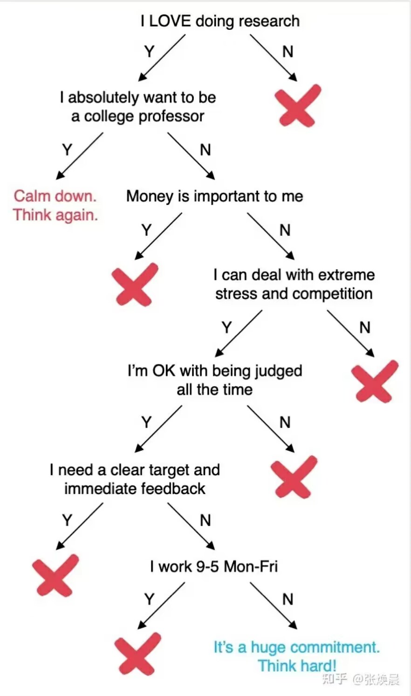

# 常见问题⭐

以下是推免过程中一些常见的问题：

**Q：我能选择什么样的学校？**

A：这取决于排名百分比，但有一些学校也会参考简历进行筛查。可参考往届同排名水平学长学姐的去向，但不要被百分比限制，水平不超出太多的学校都可以尝试投递。

**Q：学硕与专硕有什么区别？**

A：主要有以下区别：

* 计算机类学硕的代码为0812开头，专硕为0854开头。目前0854包含了许多专业类，因此考公时岗位很少，未来可能随着细分而改变。
* 大多数学校的专硕学费更高，且可能不提供宿舍(南大，复旦等)。
* 在培养方案上，各校有所不同，较多院校现在学专以相同方式培养，即也要完成科研任务。
* 专硕学制可能短于学硕学制，但是目前的趋势是专硕改为和学硕相同。

**Q：专硕改制有什么影响？**

A：原来的2.5年制专硕，延毕后也可以3年毕业，而改为3年制后，延毕则要4年才可以毕业。由于选择专硕通常是倾向于就业，尽早毕业更好。

**Q：学硕会偏向科研，专硕会偏向就业，是这样的吗？**

A：不是绝对的。这与学校政策和导师有关。首先科研与就业不完全冲突，其次如果导师分配很多横向或不放实习(一些质量不高的横向对于就业没有任何帮助)，则不利于就业；如果导师既能提供好的帮助并放实习，或者与企业有强connection，则有利于就业。随着专硕名额扩大，学硕缩减，是否有利于就业可能更与导师有关。但部分院校的专硕就是面向就业的，例如人大等，这些学校选择专硕能得到的实习机会更多。

**Q：是否选择直博？**

A：学术博可参考下图↓，工程博近些年才有，暂时不明确就业情况。

<figure><figcaption></figcaption></figure>

**Q：该如何选择导师？**

A：概况可通过研控，询问该校同学了解。学术水平查询google scholar等。

**Q：该怎么准备夏令营/预推免？**

A：主要准备项目、科研经历、基础知识、编程能力这几个方面，并查找目标院校往年考核的流程和偏好。

**Q：基础知识要准备到什么程度？**

A：以复习概念为主。并要注意自己的项目和科研经历中涉及的内容。

