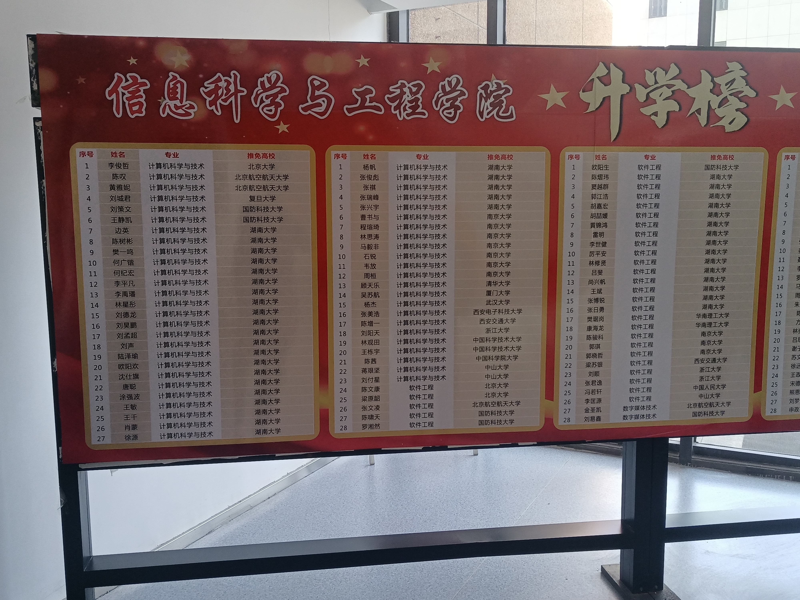

# 往届去向

⚠仅收录了计算机科学与技术专业及分流的大数据专业同学们的去向。

**2024届**

计算机科学与技术共110人，大数据科学共21人。

| 院校                       | 专业                      | 人数 |
| -------------------------- | ------------------------- | ---- |
| 清华大学软件学院           | 电子信息                  | 1    |
| 中国科学技术大学计算机学院 | 计算机科学与技术          | 1    |
| 复旦大学计算机学院         | 电子信息                  | 2    |
| 复旦大学大数据学院         | 统计机器学习              | 1    |
| 中山大学                   | 电子信息(计算机技术)      | 4    |
| 中国科学技术大学先研院     | 电子信息                  | 1    |
| 国防科技大学               | 计算机科学与技术          | 1    |
| 国防科技大学               | 计算机技术                | 1    |
| 华中科技大学               | 电子信息(计算机技术)\直博 | 4    |
| 中国科学院大学             | 计算机技术                | 1    |
| 湖南大学                   | 计算机科学与技术\电子信息 | 12   |

**2023届(⚠本届推免为线上，参考意义已较小。)**

<figure><figcaption></figcaption></figure>

