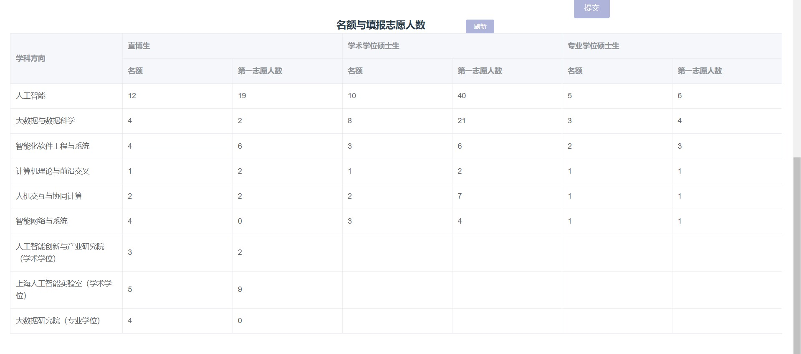

# 复旦大学

### 一.院系

强COM。

⚠复旦大学的专硕为8w/3年，不提供宿舍，研一期间可以抽签入住学校合作的爱久公寓，有住房补贴。

**计算机学院**

夏令营时入营名额较少，因此可能需要3%的排名，预推免放400人入营，对排名的要求大大降低。

研究方向的选择是入营后统一一段时间进行，为动态博弈。2023年的(夏令营)最终结果如下：

<figure><figcaption></figcaption></figure>

各个学科方向的导师见：。

**大数据学院**

### 二.经验贴导航

### 
