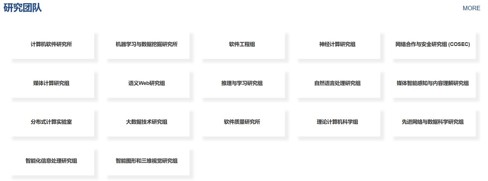

# 南京大学

一.院系

南大所有院均为极强COM，导师在入营和考核时无话语权。但可申请多个院系，最终只能确认参营一个。

⚠南京大学的专硕均不提供宿舍，软件学院在此基础上不提供工位。

⚠南软会改为三年学制但时间未定，2024年入学的还是两年学制。

⚠南京大学在夏令营期间入营较为容易，预推免只收少部分人入营且偏向南京本地学校。

[**计算机系**](https://cs.nju.edu.cn/main.htm)

计算机系的考核包括线上机考初筛(选择题)-程序设计竞赛-面试，不保护南大本校学生。

只有通过线上机考初筛才可以线下参营，线上机考不占最终分数，程序设计竞赛分数和面试分数各占最终分数的一半。

由于第一轮机试是线上的，因此会放非常多的人参加，因此10%以内应该都可以申请。程序设计竞赛难度较大，面试主要考核基础知识，无自我介绍等环节。选择题及程序设计题目见经验贴。

[**软件学院**](https://software.nju.edu.cn/)

软件学院的考核包括机考，笔试，面试。**保护**南大软院学生。考核见经验贴。

2023年929，南软最后一名递补(58)也被录取了。

[**人工智能学院**](https://ai.nju.edu.cn/mainm.htm)

⚠仅招收专业：081200 计算机科学与技术

同样有笔试和机试，笔试与计算机学院的区别是操作系统等内容改为机器学习相关内容。机试为数据结构和机器学习算法。

[**智能科学与技术学院(苏州)**](https://njusz.nju.edu.cn/\_s753/33/0c/c52363a602892/page.psp)

⚠仅招收专业：085410 人工智能

23年启用的新校区，在官网还标注了有智能软件与工程学院，但招生时暂时还只有人工智能专业。

### 二.经验贴导航

**计算机学院**

[浅浅的2021保研之旅](http://t.csdnimg.cn/KltLA)(笔试题)

**软件学院**

[南京大学软件学院 2023 年优秀大学生夏令营纪实](https://eaglebear2002.github.io/%E6%8A%80%E6%9C%AF%E7%A7%91%E6%99%AE/%E5%8D%97%E4%BA%AC%E5%A4%A7%E5%AD%A6%E8%BD%AF%E4%BB%B6%E5%AD%A6%E9%99%A2%202023%20%E5%B9%B4%E4%BC%98%E7%A7%80%E5%A4%A7%E5%AD%A6%E7%94%9F%E5%A4%8F%E4%BB%A4%E8%90%A5%E7%BA%AA%E5%AE%9E/)(❗必读，南大软院同学的经验贴和博客)

**人工智能学院**

[2020南大人工智能AI学院夏令营面试经历](http://t.csdnimg.cn/WLaOF)

[2021计算机夏令营保研经历](http://t.csdnimg.cn/fYOCW)

[2023年计算机保研小记（南大AI、复旦CS） - 纯和高茎豌豆的文章](https://zhuanlan.zhihu.com/p/659021845)

### 三.实验室

南京大学的整体研究方向为人工智能和软件相关方向。

各个实验室在[官方主页](https://cs.nju.edu.cn/main.htm)底部有链接，实力最为突出的是软件研究所和LAMDA实验室(机器学习与数据挖掘研究所)。

**计算机学院/人工智能学院**

<figure><figcaption></figcaption></figure>

**软件学院**

[研究团队主页](https://software.nju.edu.cn/szll/yjsds/index.html)
