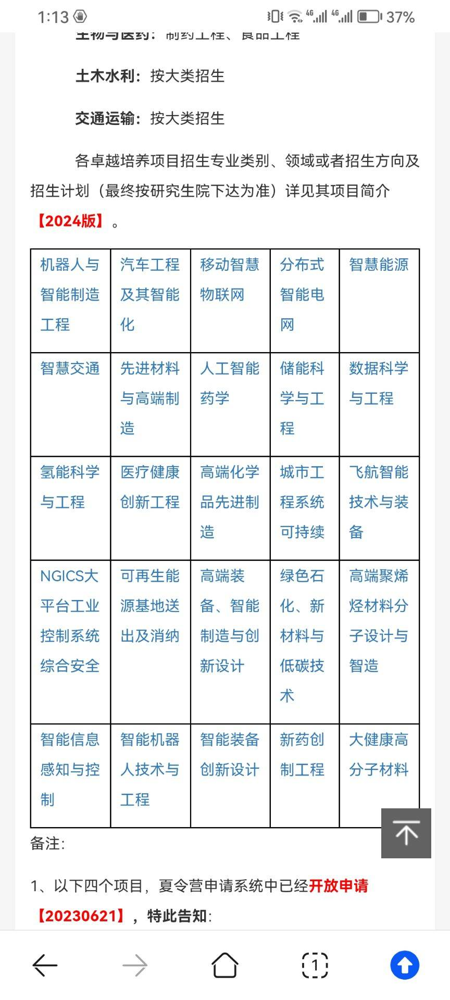

# 浙江大学

### 一.院系

浙大为强COM，且有本校保护。

⚠浙大的报名系统只能填报一个学院，并且外校基本只能拿到专硕。

⚠浙大有不同于其他学校的[盲审制度](https://www.zhihu.com/question/621231050)，延毕率高于其他学校。

**软件学院**

软院位于宁波市，师资力量不如杭州，配套的资源少。近两年更新了驻扎宁波的政策，并且已改为三年学制，不允许去外地实习，学院的要求是比较严格的，但是导师是否严格执行不明确。

保外的同学基本都可以入营，下面的经验贴末九30%+都入了。

夏令营不发offer，需要做一个项目，完成后可以保证必进预推免。2023年最终递补至wl103。

**工程师学院**

浙工是按照不同的项目招生的，2023年的项目如下：

<figure><figcaption></figcaption></figure>

浙工入营会看简历，非常看重科研与竞赛、项目。

不同项目负责的导师也不同，计算机的同学们考虑的项目基本由数院、计算机学院、控制学院的导师负责。其中最多人竞争的是数据科学项目，名额也较多。其他的项目竞争比较小，名额也较少，移动智慧物联网项目有20级rk6入营，名额为录取4个，递补4个(最后基本可以补到)，入营20个，入营的同学水平相近。招生的名额大致夏令营预推免各一半。

浙工是否放实习也是和导师有关，但是整体上是比较自由的，并且培养方案中有一段时间的实习，因此是一个纯就业向比较好的选择。

**计算机学院**

20级持有rk1的同学联系了导师也没有入营，名额很少，只收外校学硕10个左右，专硕多一些。但是其他专业有人入营。

### 二.经验贴导航

**浙软**

[2023年（2024届）末九超低rank无科研保研经验贴（浙软，西交软，厦大MAC，华科软，北师大ai） - Dreamstar的文章 - 知乎](https://zhuanlan.zhihu.com/p/659128385)(有机考题)

**浙工**

面试很常规，20min左右，PPT自我介绍+英语提问+专家提问。提问会围绕项目和简历来进行。去物联网面试的同学面了比较多的网络相关问题。
